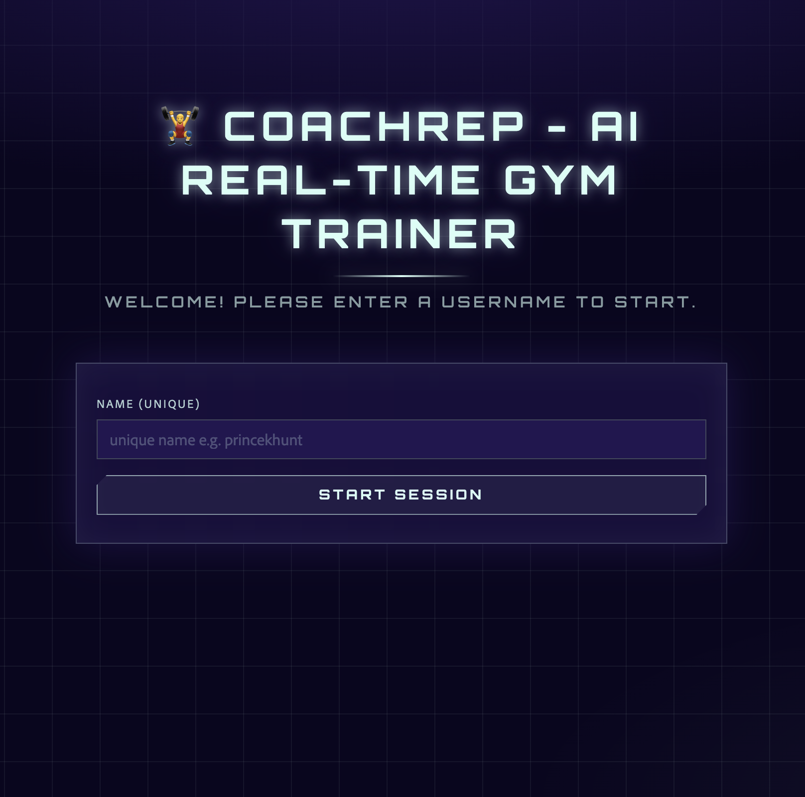

# 🏋️ CoachRep: AI Real-time Gym Coach

> CoachRep watches your form through the webcam, counts every rep, and talks you through each set with real-time AI voice coaching.

<p align="center">
  
</p>

CoachRep is a Streamlit web app that turns your webcam into a personal trainer. **MediaPipe** pose detection tracks your body, exercise-specific detectors count reps and check your form, and an LLM coach (**GPT-OSS 20B on Groq**) turns what it sees into short, spoken coaching cues.

---

## ✨ Features

- **Live pose tracking**: MediaPipe Pose Landmarker reads 33 body landmarks from your webcam stream via WebRTC.
- **5 supported exercises**, each with its own rep counter and form checks:

  | Exercise | Metrics tracked |
  |---|---|
  | Squats | Knee angle, back angle, depth status |
  | Push-ups | Elbow angle, body alignment, hip position |
  | Biceps Curls (Dumbbell) | Elbow angle, shoulder stability, swing detection |
  | Shoulder Press | Elbow angle, arm extension, back arch |
  | Lunges | Front knee angle, torso angle, balance |

- **AI voice coach**: form issues and workout events (start, set completed, workout completed, no pose detected) are sent to GPT-OSS 20B on Groq, which replies with a short coaching cue that is spoken aloud with gTTS. A 5-second cooldown keeps it from talking over you.
- **Workout plans**: pick an exercise, number of sets and reps per set, then track progress live in the sidebar.
- **Workout history**: each user's sessions are saved to a local SQLite database and shown as a daily summary.
- **Simple login**: enter a unique username to keep your history separate.
- **Futuristic UI**: a custom mint (`#D6FFF6`) and indigo (`#231651`) theme with Orbitron headings and a HUD-style grid background.
- **Reliable video**: optional Twilio TURN servers help the webcam stream connect behind strict networks.

---

## 🧠 How it works

```
Webcam ──► streamlit-webrtc ──► MediaPipe Pose ──► Exercise detector
                                                     │  (angles, reps, form status)
                                                     ▼
                                Sidebar metrics ◄── Metrics sync
                                                     │
                                         Form issue / workout event
                                                     ▼
                                     Groq · GPT-OSS 20B (coaching cue)
                                                     ▼
                                          gTTS ──► Audio played in browser
```

Each detector extends a shared `BaseExercise` class and computes joint angles from landmarks to decide the movement stage (up/down) and count a rep when a full range of motion is completed.

---

## 🛠️ Tech stack

| Layer | Tools |
|---|---|
| UI | Streamlit, custom CSS (Orbitron + Adobe Clean) |
| Video | streamlit-webrtc, OpenCV, Twilio TURN (optional) |
| Pose estimation | MediaPipe (Pose Landmarker, full model) |
| AI coaching | Groq API · `openai/gpt-oss-20b` |
| Text-to-speech | gTTS |
| Storage | SQLite, pandas |

---

## 📁 Project structure

```
CoachRep/
├── main.py                      # Streamlit entry point
├── requirements.txt             # Python dependencies
├── packages.txt                 # System packages (for Streamlit Cloud)
├── .streamlit/
│   └── config.toml              # Theme colours and toolbar settings
├── assets/                      # README screenshots
├── core/
│   └── base_exercise.py         # Shared angle math and rep logic
├── detectors/                   # One detector per exercise
│   ├── squat.py
│   ├── pushup.py
│   ├── biceps_curl.py
│   ├── shoulder_press.py
│   └── lunges.py
├── ml_models/
│   └── pose_landmarker_full.task
├── services/
│   ├── auth/                    # Username login wall
│   ├── coaching/                # LLM coach, TTS, voice pipeline
│   ├── config/                  # Exercise list, metrics fields, coach prompt
│   ├── persistence/             # SQLite user and workout storage (data.db)
│   ├── state/                   # Session state defaults
│   ├── tracking/                # Syncs live metrics into the UI
│   ├── ui/                      # CSS and font loaders
│   └── vision/                  # WebRTC video processor and ICE servers
└── static/                      # App stylesheet and font
```

---

## 🚀 Getting started

### Prerequisites

- Python 3.10+
- A webcam
- A free [Groq API key](https://console.groq.com/keys)

### 1. Clone the repo

```bash
git clone https://github.com/ravihw7/CoachRep.git
cd CoachRep
```

### 2. Create a virtual environment and install dependencies

```bash
python -m venv venv
# macOS / Linux
source venv/bin/activate
# Windows
venv\Scripts\activate

pip install -r requirements.txt
```

### 3. Add your API keys

The app reads `GROQ_API_KEY` from an environment variable (a `.env` file works too) or from Streamlit secrets.

**Option A: environment variable**

```bash
# macOS / Linux
export GROQ_API_KEY=your_groq_api_key_here
# Windows (PowerShell)
$env:GROQ_API_KEY="your_groq_api_key_here"
```

**Option B: Streamlit secrets** (also what Streamlit Cloud uses). Create `.streamlit/secrets.toml`:

```toml
GROQ_API_KEY = "your_groq_api_key_here"

# Optional: Twilio TURN servers for the webcam stream.
# Without them the app falls back to public STUN, which can fail on strict networks.
TWILIO_ACCOUNT_SID = "your_twilio_account_sid"
TWILIO_AUTH_TOKEN = "your_twilio_auth_token"
```

> Keep your keys out of Git. Add `.streamlit/secrets.toml` to `.gitignore`.

### 4. Run the app

```bash
streamlit run main.py
```

Open the URL shown in the terminal (usually `http://localhost:8501`), allow camera access, and you're ready.

---

## 🏃 Usage

1. Enter a unique username to log in.
2. In the sidebar, choose an **exercise**, the number of **sets**, and **reps per set**.
3. Click **Start Workout**, then start the camera stream.
4. Step back so your whole body is visible, and start exercising.
5. Watch your reps, sets and form metrics update live while the coach calls out corrections.
6. Click **End Workout** when you're done. Your session appears in **Workout History**.

**Tips for accurate tracking:** use good lighting, keep your full body in frame, and stand side-on to the camera for squats, push-ups and lunges.

---

## ☁️ Deployment

The app is ready for **Streamlit Community Cloud**:

1. Push the repo to GitHub.
2. Create a new app on Streamlit Cloud with `main.py` as the entry point.
3. Add `GROQ_API_KEY` (and optionally `TWILIO_ACCOUNT_SID` / `TWILIO_AUTH_TOKEN`) under the app's **Secrets**.

`packages.txt` installs the system libraries OpenCV and MediaPipe need, and `.streamlit/config.toml` applies the theme.

---

## 🗺️ Roadmap ideas

- More exercises (deadlifts, planks, jumping jacks)
- Progress charts and streaks
- Multi-language voice coaching
- Proper authentication

---

## 🤝 Contributing

Contributions are welcome:

1. Fork the repo
2. Create a branch: `git checkout -b feature/your-feature`
3. Commit your changes: `git commit -m "Add your feature"`
4. Push the branch: `git push origin feature/your-feature`
5. Open a pull request

---

## 👤 Author

**Ravi Harshwardhan**, AI/ML Engineer

- GitHub: [@ravihw7](https://github.com/ravihw7)
- LinkedIn: [ravihwoff](https://www.linkedin.com/in/ravihwoff)

If you found this project useful, consider giving it a ⭐

---

## 🙏 Acknowledgements

- Original project by [Shradha Khapra](https://github.com/shradha-khapra/ai-gym-coach)
- [MediaPipe](https://developers.google.com/mediapipe) for pose estimation
- [Groq](https://groq.com) for fast LLM inference
- [Streamlit](https://streamlit.io) and [streamlit-webrtc](https://github.com/whitphx/streamlit-webrtc)
